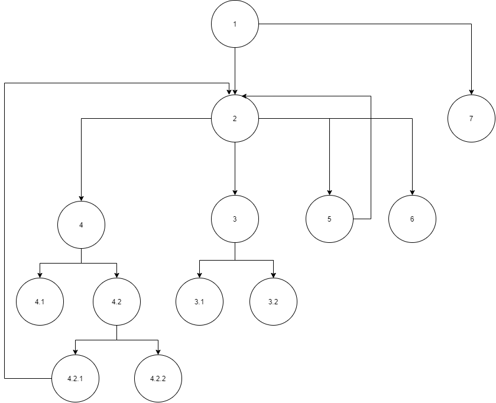

# Втора лабораториска вежба по Софтверско инженерство

## Христијан Мучев, бр. на индекс 161007

### Control Flow Graph



### Цикломатска комплексност

Комплексноста изнесува 13, тоа е добиено со помош на формулата: `E - N + 2 * P` каде што E е бројот на линии, а N е бројот на јазли, бројот P е бројот на јазли кои што претставуваат излез од програмата.
Во оваа функција броевите изнесуваат:

- E = 14
- N = 13
- P = 6

```text
14 - 13 + 2 * 6 = 13
```


### Тест случаи според критериумот Every branch

1. Случај кога листата е празна.
2. Случај кога листата е валидна и кога имаме елементи кои се валидни. 
3. Случај кога лисатата е валидна и имаме елемент време, во кој што часовите не се валидни.
4. Сличај кога листата е валидна и имаме елемент време, во кој што минутите не се валидни.
5. Случај кога листата е валидна и имаме елемент време, во кој што секундите не се валидни.  

